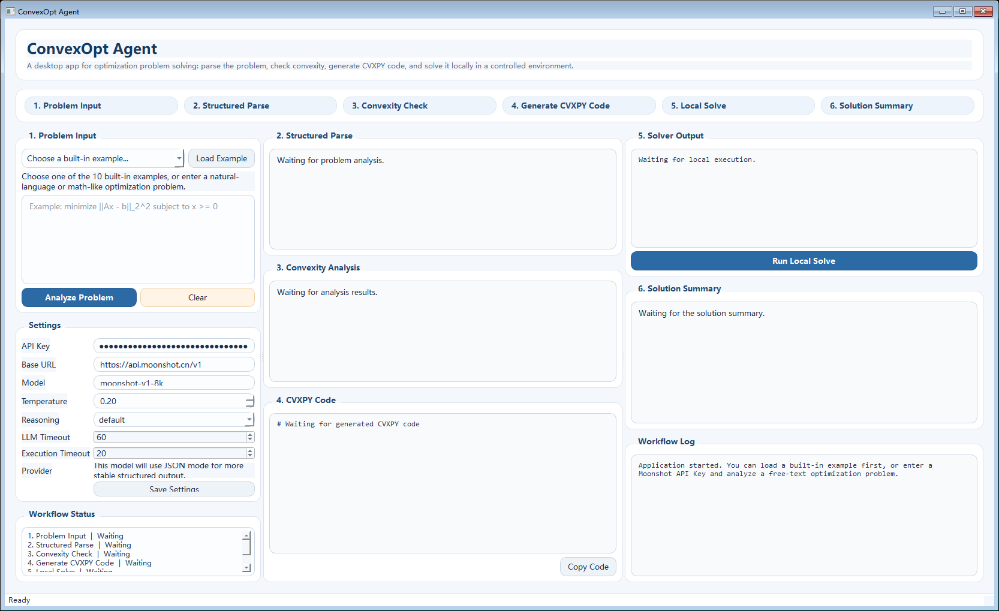

# ConvexOpt Agent

`ConvexOpt Agent` is a Windows desktop application for optimization problem solving.

It provides a controlled end-to-end workflow:

1. Parse optimization problems from natural language or math-like text
2. Decide whether a problem is convex
3. Generate runnable CVXPY code
4. Execute Python + CVXPY locally in a controlled temporary workspace
5. Present solver results and a concise solution summary

## UI Screenshot



## Tech Stack

- GUI: PySide6
- Backend: Python 3.11+
- LLM Provider: Kimi via Moonshot API
- LLM Client: OpenAI-compatible Python SDK
- Optimization: CVXPY
- Packaging: PyInstaller

## Current Features

- Accept natural language optimization problems or math-like text
- Load 10 built-in optimization examples
- Show structured variables, objectives, constraints, and problem families
- Provide convexity checks with concise reasoning
- Generate copyable CVXPY code
- Execute code in a controlled local temporary workspace
- Display solver status, optimal value, variable values, and dual values
- Include a workflow log panel and step-status panel
- Persist API Key, Base URL, Model, Temperature, Reasoning, and Timeout settings

## Built-in Examples

- least squares
- ridge regression
- lasso
- LP
- QP
- portfolio optimization
- logistic regression
- soft-margin SVM
- basis pursuit
- resource allocation

## Project Structure

```text
ConvexOptAgent/
├─ run_app.py
├─ requirements.txt
├─ build_exe.ps1
├─ convexopt_tutor_agent.spec
└─ src/
   └─ convexopt_tutor_agent/
      ├─ app.py
      ├─ core/
      ├─ execution/
      ├─ examples/
      ├─ llm/
      └─ ui/
```

## Requirements

- Windows
- Python 3.11 or newer
- `py` launcher recommended

## Install Dependencies

```powershell
git clone https://github.com/guoyuan-dotcom/ConvexOptAgent.git
cd ConvexOptAgent
py -m pip install -r requirements.txt
```

## Run the App

```powershell
cd ConvexOptAgent
py run_app.py
```

## Moonshot / Kimi Configuration

Default in-app settings:

- Base URL: `https://api.moonshot.cn/v1`
- Model: `moonshot-v1-8k`

For free-text analysis, fill in:

- `API Key`

Notes:

- Built-in examples can be demonstrated offline without an API key.
- Free-text problems use Moonshot / Kimi for structured parsing and code generation.
- Final numerical answers always come from local CVXPY execution, not directly from the LLM.

## Recommended Usage

Recommended flow:

1. Start with a built-in example to confirm the parsing, modeling, and execution pipeline works.
2. Enter a natural language problem and review the structured parse and convexity check.
3. Run local execution only for convex problems.
4. For non-convex problems, rely on the app's stop-at-analysis safety behavior.

## Safety Boundaries

This project is not a general-purpose autonomous code execution agent. The execution path is restricted as follows:

- No arbitrary shell input is exposed in the UI
- Generated code is validated with an AST safety check before execution
- Only `cvxpy`, `numpy`, and `math` imports are allowed
- Dangerous capabilities such as `os`, `sys`, `subprocess`, `pathlib`, `open`, `eval`, and `exec` are blocked
- Local execution always runs inside a controlled temporary workspace
- Python is launched with `subprocess.run(..., shell=False)` rather than through a shell
- Execution is terminated on timeout

Notes:

- The Python-level sandbox is not the same as OS-level isolation.
- This is controlled desktop-app execution, not a hardened sandbox against malicious code.
- The app should still be used with trusted inputs.

## Known Limitations

- If a free-text problem does not provide concrete numeric data, the LLM may synthesize a small deterministic instance
- In those cases, the local numerical solution corresponds to the synthesized instance, not necessarily the original symbolic problem
- If convexity cannot be established with enough confidence, the app stops at analysis and does not auto-solve
- Solver availability depends on the CVXPY solvers installed on the local machine

## Roadmap

- Completed: a runnable version covering Phase 1 through Phase 7
- Possible next improvements:
- Stricter JSON schema validation
- Richer non-convex diagnostics
- More detailed dual / KKT visualization
- Exported result reports
